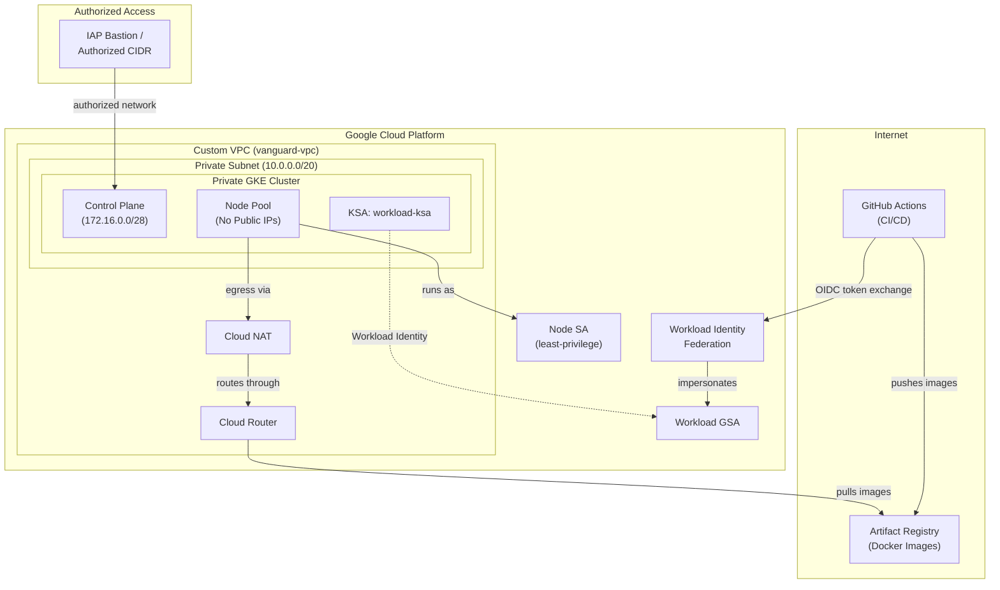

#  GCP-Kube-Vanguard

**Enterprise-Grade Private GKE Deployment on Google Cloud Platform**

A production-hardened, modular Terraform codebase that deploys a fully private Google Kubernetes Engine cluster with defense-in-depth security, least-privilege IAM, Workload Identity, and CI/CD via GitHub Actions.

---

## Architecture



---

## Security Deep-Dive

###  Why Private Clusters?

A **Private GKE Cluster** enforces network-level isolation that eliminates the most common Kubernetes attack vectors:

| Security Property | How It's Enforced |
|---|---|
| **No public node IPs** | `enable_private_nodes = true` — nodes receive only RFC 1918 addresses. An attacker cannot reach nodes directly from the internet, even if a pod is compromised. |
| **Control-plane access control** | `master_authorized_networks_config` restricts API server access to specific CIDR blocks (e.g., IAP bastion `35.235.240.0/20`). Unauthorized networks receive `connection refused`. |
| **Egress-only internet** | Cloud NAT provides outbound connectivity for pulling container images without exposing an inbound attack surface. |
| **VPC peering isolation** | The control plane runs in a Google-managed VPC that peers with your VPC via `master_ipv4_cidr_block`. There is no transitive peering — lateral movement is architecturally prevented. |
| **Shielded Nodes** | `enable_shielded_nodes` verifies node boot integrity via vTPM and Secure Boot, preventing rootkit-class attacks on the underlying VM. |
| **Dataplane V2** | Cilium-based eBPF networking provides kernel-level network policy enforcement — no iptables bottleneck, with built-in observability. |

###  Why Workload Identity?

Traditional approaches mount JSON key files into pods — a **critical anti-pattern** because:

1. Keys are long-lived and don't auto-rotate
2. A single compromised pod exposes the key to all workloads
3. Keys stored in Secrets can be exfiltrated via RBAC misconfigurations

**Workload Identity** eliminates all three risks:

```
Pod (KSA: workload-ksa)
  │
  ├── requests token from GKE metadata server
  │
  ├── GKE metadata server mints a short-lived OIDC token
  │   scoped to: PROJECT_ID.svc.id.goog[NAMESPACE/KSA_NAME]
  │
  ├── Token is exchanged for a GCP access token via STS
  │
  └── Pod operates as GSA: workload-gsa@PROJECT.iam.gserviceaccount.com
      (with ONLY the IAM roles bound to that GSA)
```

**Key benefits:**
- **No keys to leak** — credentials are short-lived tokens rotated automatically
- **Per-pod identity** — each KSA maps to exactly one GSA; blast radius is contained
- **Auditability** — all API calls appear in Cloud Audit Logs under the GSA identity

###  Least-Privilege Node Service Account

The default Compute Engine SA (`PROJECT_NUMBER-compute@developer.gserviceaccount.com`) has **Editor** access — far too broad. This codebase creates a dedicated node SA with only:

| Role | Purpose |
|---|---|
| `roles/logging.logWriter` | Ship container logs to Cloud Logging |
| `roles/monitoring.metricWriter` | Write metrics to Cloud Monitoring |
| `roles/monitoring.viewer` | Read monitoring dashboards |
| `roles/artifactregistry.reader` | Pull images from Artifact Registry |
| `roles/stackdriver.resourceMetadata.writer` | Write resource metadata |

---

## Repository Structure

```
GCP-Kube-Vanguard/
├── main.tf                          # Root module — wires all child modules
├── variables.tf                     # Root input variables
├── outputs.tf                       # Root outputs
├── providers.tf                     # Provider & version constraints
├── backend.tf                       # GCS remote state backend
├── terraform.tfvars.example         # Example variable values
├── .gitignore
│
├── modules/
│   ├── networking/                  # VPC, Subnet, Cloud Router, Cloud NAT
│   │   ├── main.tf
│   │   ├── variables.tf
│   │   └── outputs.tf
│   │
│   ├── cluster/                     # Private GKE Cluster, Node Pool, Node SA
│   │   ├── main.tf
│   │   ├── variables.tf
│   │   └── outputs.tf
│   │
│   ├── iam/                         # Workload Identity KSA ↔ GSA binding
│   │   ├── main.tf
│   │   ├── variables.tf
│   │   └── outputs.tf
│   │
│   └── registry/                    # Google Artifact Registry
│       ├── main.tf
│       ├── variables.tf
│       └── outputs.tf
│
├── .github/
│   └── workflows/
│       └── ci.yaml                  # GitHub Actions: build, push, validate
│
└── README.md
```

---

## Prerequisites

| Requirement | Version |
|---|---|
| [Terraform](https://www.terraform.io/) | >= 1.5 |
| [Google Cloud SDK](https://cloud.google.com/sdk) | Latest |
| GCP Project with billing enabled | — |

### Required GCP APIs

```bash
gcloud services enable \
  container.googleapis.com \
  compute.googleapis.com \
  artifactregistry.googleapis.com \
  iam.googleapis.com \
  iamcredentials.googleapis.com \
  cloudresourcemanager.googleapis.com \
  sts.googleapis.com
```

---

## Deployment

### 1. Bootstrap Remote State

```bash
# Create the GCS bucket for Terraform state
export PROJECT_ID="your-project-id"
export REGION="europe-west1"

gsutil mb -p $PROJECT_ID -l $REGION -b on gs://${PROJECT_ID}-tfstate
gsutil versioning set on gs://${PROJECT_ID}-tfstate
```

Update the bucket name in [`backend.tf`](./backend.tf).

### 2. Configure Variables

```bash
cp terraform.tfvars.example terraform.tfvars
# Edit terraform.tfvars with your project-specific values
```

### 3. Deploy

```bash
terraform init
terraform plan -out=tfplan
terraform apply tfplan
```

### 4. Connect to the Cluster

```bash
gcloud container clusters get-credentials \
  $(terraform output -raw cluster_name) \
  --zone $(terraform output -raw zone) \
  --project $PROJECT_ID

# Verify Workload Identity
kubectl get serviceaccount workload-ksa -o yaml
```

---

## CI/CD Pipeline (GitHub Actions)

The pipeline uses **Workload Identity Federation** — a keyless authentication mechanism that exchanges a GitHub OIDC token for short-lived GCP credentials.

### Setup Workload Identity Federation

```bash
# 1. Create a Workload Identity Pool
gcloud iam workload-identity-pools create "github-pool" \
  --project=$PROJECT_ID \
  --location="global" \
  --display-name="GitHub Actions Pool"

# 2. Create an OIDC Provider
gcloud iam workload-identity-pools providers create-oidc "github-provider" \
  --project=$PROJECT_ID \
  --location="global" \
  --workload-identity-pool="github-pool" \
  --display-name="GitHub Provider" \
  --attribute-mapping="google.subject=assertion.sub,attribute.repository=assertion.repository" \
  --issuer-uri="https://token.actions.githubusercontent.com"

# 3. Bind the SA to the GitHub repository
gcloud iam service-accounts add-iam-policy-binding \
  "ci-sa@${PROJECT_ID}.iam.gserviceaccount.com" \
  --project=$PROJECT_ID \
  --role="roles/iam.workloadIdentityUser" \
  --member="principalSet://iam.googleapis.com/projects/PROJECT_NUMBER/locations/global/workloadIdentityPools/github-pool/attribute.repository/YOUR_ORG/GCP-Kube-Vanguard"
```

### Required GitHub Secrets

| Secret | Description |
|---|---|
| `GCP_PROJECT_ID` | Your GCP project ID |
| `WIF_PROVIDER` | Full resource name of the WIF OIDC provider |
| `WIF_SERVICE_ACCOUNT` | Email of the CI/CD service account |
| `GAR_REGION` | Artifact Registry region (e.g., `europe-west1`) |
| `GAR_REPOSITORY` | Artifact Registry repository ID |

---

## Outputs Reference

| Output | Description | Sensitive |
|---|---|---|
| `cluster_name` | GKE cluster name | No |
| `cluster_endpoint` | Control-plane endpoint | ✅ |
| `cluster_ca_certificate` | Cluster CA certificate | ✅ |
| `node_service_account_email` | Node SA email | No |
| `workload_gsa_email` | Workload GSA email | No |
| `workload_ksa_name` | Kubernetes SA name | No |
| `gar_repository_url` | GAR Docker repo URL | No |

---

## Cost Considerations

> [!WARNING]
> This deploys billable GCP resources. For sandbox usage, consider:
> - Using `e2-small` or `e2-micro` machine types
> - Setting `max_node_count = 1`
> - Destroying the cluster when not in use: `terraform destroy`

The primary cost drivers are:
- **GKE cluster management fee** (~$0.10/hr for Standard tier)
- **Compute Engine nodes** (varies by machine type)
- **Cloud NAT** (per-VM charge + data processing)

---

## License

This project is licensed under the MIT License.
